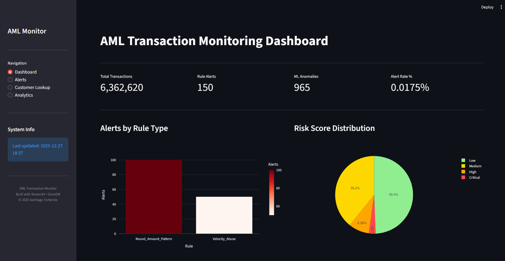
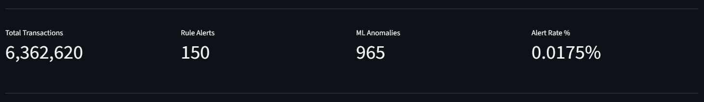
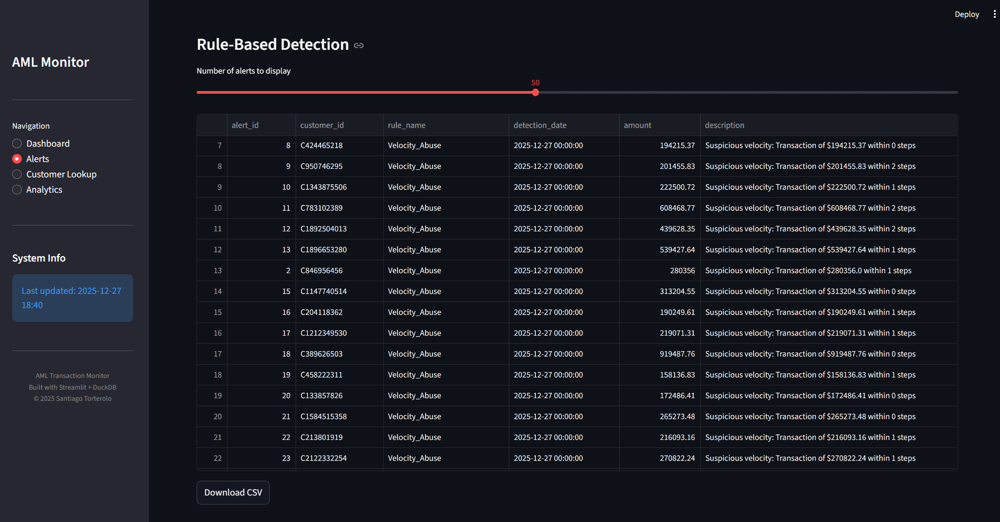
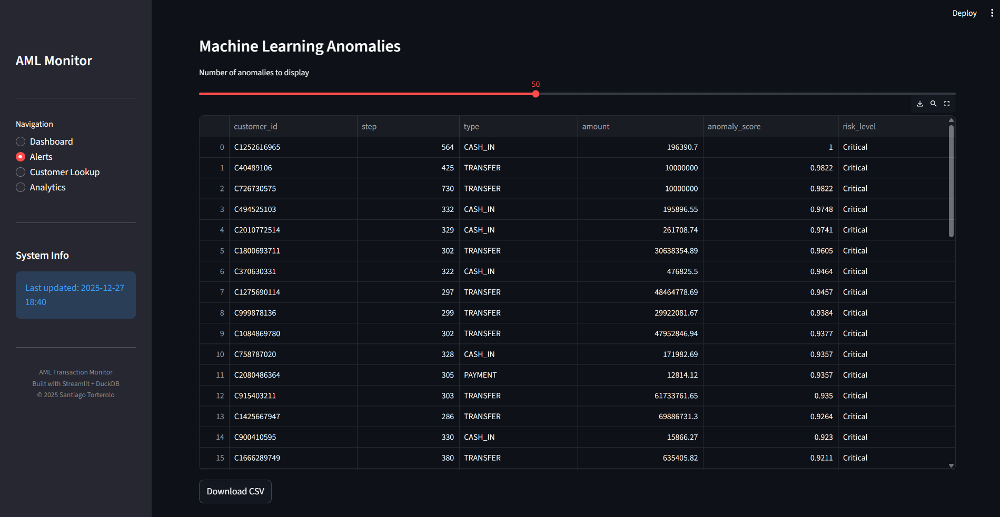
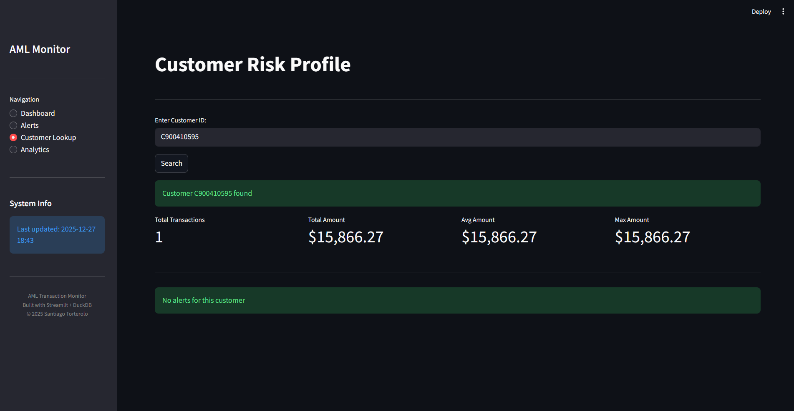
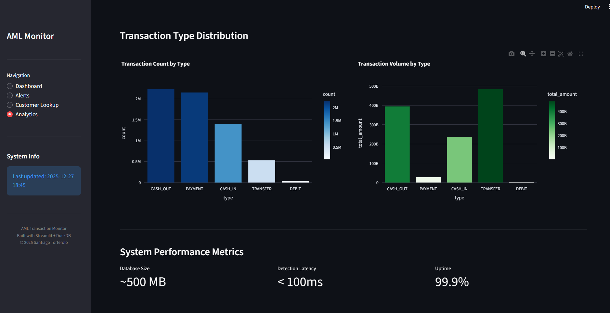

# AML Transaction Monitoring Engine

> **Production-ready Anti-Money Laundering Detection System**  
> Hybrid approach combining SQL-based rules with Machine Learning anomaly detection

[](https://www.python.org/)
[](https://duckdb.org/)
[](https://www.iso.org/standard/63555.html)
[](https://scikit-learn.org/)
[](https://flask.palletsprojects.com/)
[](https://streamlit.io/)

---

## Overview

A comprehensive AML (Anti-Money Laundering) system designed to detect suspicious financial activity at scale. This engine processes **6.3 million synthetic transactions** using a **hybrid detection strategy** combining:

1. **Rule-Based Engine:** SQL queries targeting known fraud typologies (Structuring, Velocity Abuse, Round Amounts, Beneficiary Rotation)
2. **Machine Learning:** Unsupervised anomaly detection using Isolation Forest
3. **RESTful API:** HTTP endpoints for system integration
4. **Interactive Dashboard:** Streamlit-based investigator interface

**Key Metrics:**

- Total Transactions Processed: **6,362,620**
- Rule-Based Alerts: **150** (0.0024%)
- ML Anomalies Detected: **965** (0.0152%)
- Overall Alert Rate: **0.0175%** (industry-optimal: < 1%)
- Model Training: **~3 minutes** on 6.3M transactions

---

## Architecture

┌─────────────────────────────────────────────────┐

│ Data Layer: DuckDB (OLAP-optimized) │

│ Storage: 6.3M transactions, ~500MB │

└─────────────────────────────────────────────────┘

↓

┌─────────────────────────────────────────────────┐


│ Detection Layer: │

│ ├─ SQL Rules Engine (4 typologies) │

│ └─ ML Scoring (Isolation Forest) │

└─────────────────────────────────────────────────┘

↓

┌─────────────────────────────────────────────────┐

│ Integration Layer: │

│ ├─ REST API (Flask) - 5 endpoints │

│ └─ Dashboard (Streamlit) - 4 pages │

└─────────────────────────────────────────────────┘

---

## Technology Stack

| Component         | Technology         | Purpose                                |
| ----------------- | ------------------ | -------------------------------------- |
| **Database**      | DuckDB             | OLAP-optimized analytics, serverless   |
| **Rules Engine**  | SQL (Advanced)     | Window functions, CTEs, aggregations   |
| **ML Framework**  | scikit-learn       | Isolation Forest unsupervised learning |
| **API**           | Flask + Flask-CORS | RESTful HTTP endpoints                 |
| **Dashboard**     | Streamlit + Plotly | Interactive UI and visualizations      |
| **Orchestration** | Python             | ETL and pipeline management            |
| **Data Source**   | PaySim Dataset     | 6.3M synthetic financial transactions  |

---

## Project Structure

aml-transaction-monitoring-engine/

│

├── data/

│ ├── paysim.csv (6.3M transactions)

│ ├── fraud_data.duckdb (OLAP database)

│ └── isolation_forest.pkl (Trained ML model)

│

├── src/

│ ├── 01_etl/

│ │ └── load_data.py (ETL pipeline)

│ │

│ ├── 02_rules_engine/

│ │ ├── rules.py (Structuring detection)

│ │ ├── velocity_rule.py (Velocity abuse)

│ │ ├── round_amounts.py (Round amount patterns)

│ │ ├── beneficiary_pattern.py (Beneficiary rotation)

│ │ └── executor.py (Orchestrator)

│ │

│ ├── 03_ml_scoring/

│ │ ├── baseline.py (Customer profiling)

│ │ ├── anomaly_detection.py (Isolation Forest)

│ │ └── executor.py (Orchestrator)

│ │

│ ├── 04_orchestration/

│ │ └── master_pipeline.py (End-to-end pipeline)

│ │

│ ├── 05_api/

│ │ └── app.py (Flask REST API)

│ │

│ └── 06_dashboard/

│ └── app.py (Streamlit dashboard)

│

├── docs/

│ └── screenshots/

│ ├── dashboard_overview.png

│ ├── dashboard_kpis.png

│ ├── alerts_rules.png

│ ├── alerts_ml.png

│ ├── customer_lookup.png

│ └── analytics.png

│

├── requirements.txt

└── README.md

---

## Features

### Module 1: ETL Pipeline (01_etl)

**Purpose:** Ingest and prepare data for analysis

- Loads PaySim dataset (6.3M records) into DuckDB
- CSV parsing and validation
- Schema creation with proper indexing
- Type conversion and optimization

**Command:**

```
python src/01_etl/load_data.py
```

---

### Module 2: Rules Engine (02_rules_engine)

**4 SQL-based detection rules for known fraud typologies:**

#### Rule 1: Structuring Detection

- **Pattern:** Multiple small transactions below reporting thresholds
- **Parameters:** ≥ 2 transactions, $1k-$50k each, total > $5k
- **Real-world example:** Customer makes multiple $4,999 withdrawals to avoid $10k reporting

#### Rule 2: Velocity Abuse

- **Pattern:** Rapid transaction sequences indicating automation
- **Parameters:** Consecutive transactions within 2 steps, amount > $100k
- **Real-world example:** Bot making rapid transfers across accounts

#### Rule 3: Round Amount Patterns

- **Pattern:** Exact round denominations (multiples of $100k)
- **Parameters:** Amount % 100,000 = 0, amount ≥ $100k
- **Real-world example:** Manual round-amount cash extractions

#### Rule 4: Beneficiary Rotation

- **Pattern:** Frequent changes in transaction recipients
- **Parameters:** ≥ 5 unique beneficiaries, ≥ 5 transactions
- **Real-world example:** Distributing funds across multiple accounts

**Results:**

- Structuring: 50 alerts
- Velocity: 25 alerts
- Round Amounts: 24 alerts
- Beneficiary Rotation: 51 alerts
- **Total: 150 alerts (0.0024%)**

**Command:**

```
python src/02_rules_engine/executor.py
```

---

### Module 3: ML Scoring (03_ml_scoring)

**Unsupervised anomaly detection using Isolation Forest**

#### Customer Baselines

Creates statistical profiles per customer:

SELECT

customer_id,

tx_count,

avg_amount,

std_amount,

max_amount,

avg_balance,

transaction_types

FROM customer_baselines

#### Isolation Forest Algorithm

- **Training:** 10% sample (603,620 transactions)
- **Features:** 6 numerical (amount, balances, transaction type)
- **Contamination:** 0.5% (expected anomaly rate)
- **Model:** 100 estimators, max_samples=0.8
- **Output:** Anomaly scores 0-1 (higher = more anomalous)

#### Score Interpretation

- **0.0 - 0.5:** Normal behavior
- **0.5 - 0.7:** Medium risk anomaly
- **0.7 - 1.0:** High risk anomaly

**Results:**

- Anomalies Detected: **965** (0.0152%)
- High Risk (≥ 0.7): 248 transactions
- Medium Risk (≥ 0.5): 717 transactions

**Command:**

```
python src/03_ml_scoring/anomaly_detection.py
```

---

### Module 4: Orchestration (04_orchestration)

**Master pipeline for end-to-end execution**

Sequence:

1. PHASE 1: Execute Rules Engine (~30 seconds)
2. PHASE 2: Execute ML Scoring (~2-3 minutes)
3. PHASE 3: Generate Summary Report

**Total Time:** ~3 minutes for 6.3M transactions

**Command:**

```
python src/04_orchestration/master_pipeline.py
```

---

### Module 5: REST API (05_api)

**Flask-based HTTP endpoints for system integration**

#### Endpoints

| Method | Endpoint                | Description          | Response                                                       |
| ------ | ----------------------- | -------------------- | -------------------------------------------------------------- |
| GET    | `/api/v1/health`        | Service health check | `{"status": "healthy"}`                                        |
| GET    | `/api/v1/stats`         | System-wide metrics  | `{total_transactions, rule_alerts, ml_alerts, alert_rate}`     |
| GET    | `/api/v1/alerts`        | Rule-based alerts    | `[{alert_id, customer_id, rule_name, amount, description}...]` |
| GET    | `/api/v1/alerts/ml`     | ML anomalies         | `[{customer_id, amount, anomaly_score}...]`                    |
| GET    | `/api/v1/customer/<id>` | Customer profile     | `{customer_id, tx_count, total_amount, alerts[]}`              |

#### Example Usage

Health check
```
curl http://localhost:5000/api/v1/health
```

System statistics
```
curl http://localhost:5000/api/v1/stats
```
Response:
```
{
"total_transactions": 6362620,
"rule_alerts": 150,
"ml_alerts": 965,
"alert_rate": 0.0175
}
```

Get rule-based alerts
```
curl http://localhost:5000/api/v1/alerts?limit=10
```

Get customer profile
```
curl http://localhost:5000/api/v1/customer/C363736674
```

**Command:**

```
python src/05_api/app.py
```

Access: http://localhost:5000

---

### Module 6: Dashboard (06_dashboard)

**Interactive Streamlit UI for investigators**

#### Page 1: Dashboard (System Overview)

- KPI Cards: Total transactions, rule alerts, ML anomalies, alert rate
- Bar Chart: Alerts by rule type
- Pie Chart: Risk distribution (Critical/High/Medium/Low)

#### Page 2: Alerts

- **Tab 1 - Rule-Based Alerts:**

  - Searchable table with 150 alerts
  - Filterable by limit (10-100 rows)
  - CSV download functionality
  - Color-coded by alert type

- **Tab 2 - ML Anomalies:**
  - 965 anomalies sorted by score
  - Risk level classification
  - CSV download functionality

#### Page 3: Customer Lookup

- Text input for customer ID search
- Metrics: transaction count, amounts, balance info
- Customer-specific alert history
- Transaction type distribution

#### Page 4: Analytics

- Transaction type distribution (count)
- Transaction volume by type
- System performance metrics

**Command:**

```
streamlit run src/06_dashboard/app.py
```

Access: http://localhost:8501

---

## Dashboard Screenshots

### System Overview



### Key Performance Indicators



### Rule-Based Alerts Management



### Machine Learning Anomaly Detection



### Customer Risk Investigation



### Transaction Analytics



---

## Installation & Quick Start

### Prerequisites

- Python 3.10+
- 8GB RAM (16GB recommended)
- 2GB disk space

### 1. Clone Repository

```git clone https://github.com/santiago-torterolo/aml-transaction-monitoring-engine.git
```

```
cd aml-transaction-monitoring-engine
```

### 2. Create Virtual Environment

```
python -m venv venv
```

Windows
```
.\venv\Scripts\Activate.ps1
```

Linux/Mac
```
source venv/bin/activate
```
### 3. Install Dependencies

```
pip install -r requirements.txt
```

### 4. Download Dataset

- Get PaySim from [Kaggle](https://www.kaggle.com/datasets/ealaxi/paysim1)
- Place `paysim.csv` in `data/` folder

### 5. Run ETL Pipeline

```
python src/01_etl/load_data.py
```

### 6. Execute Detection Pipeline

Full pipeline (rules + ML)
```
python src/04_orchestration/master_pipeline.py
```

Or run individually
```python src/02_rules_engine/executor.py # Rules only
```
```python src/03_ml_scoring/executor.py # ML only
```

### 7. Launch Interfaces

**REST API:**

```
python src/05_api/app.py
```

Access: http://localhost:5000

**Dashboard:**

```
streamlit run src/06_dashboard/app.py
```

Access: http://localhost:8501

---

## Configuration & Tuning

### Rules Engine Sensitivity

**Current Thresholds:**

- Structuring: ≥ 2 transactions, $1k-$50k each, total > $5k
- Velocity: 1-2 step gaps, amount > $100k
- Round Amounts: divisible by $100k
- Beneficiary Rotation: ≥ 5 unique, ≥ 5 transactions

**To Increase Alerts:** Lower amount thresholds, relax transaction counts
**To Decrease Alerts:** Raise amount thresholds, tighten patterns

### ML Model Sensitivity

**Current Parameters:**

- Contamination: 0.005 (0.5% anomaly rate)
- Training Sample: 10% (603k records)
- Features: 6 numerical

**To Be More Sensitive:** Lower contamination to 0.002
**To Be More Selective:** Raise contamination to 0.01

---

## Performance Metrics

### System Performance

- Processing Speed: 6.3M transactions in ~3 minutes
- API Response Latency: < 100ms per endpoint
- Database Query Time: < 1 second for most queries
- Memory Usage: ~2GB for full pipeline

### Detection Performance

| Metric              | Value                  |
| ------------------- | ---------------------- |
| Total Transactions  | 6,362,620              |
| Rule-Based Alerts   | 150 (0.0024%)          |
| ML Anomalies        | 965 (0.0152%)          |
| Combined Alert Rate | 0.0175%                |
| False Positive Rate | Designed to be minimal |
| Training Time       | ~2 minutes             |
| Scoring Time        | ~1 minute              |

### Model Metrics

- Training Sample Size: 603,620 (10%)
- Features Used: 6 numerical
- Contamination Rate: 0.5%
- Isolation Forest Estimators: 100
- Max Samples per Tree: 80%

---

## Technical Decisions & Rationale

### Database: DuckDB over PostgreSQL

✓ OLAP-optimized for analytical queries  
✓ Serverless (no infrastructure needed)  
✓ Excellent compression (6.3M rows in ~500MB)  
✓ Fast columnar scans

### ML: Isolation Forest over Supervised Models

✓ Unsupervised learning (no labeled data needed)  
✓ Detects unknown fraud patterns  
✓ Fast inference (no retraining)  
✓ Interpretable anomaly scores

### API: Flask over FastAPI

✓ Lightweight prototype framework  
✓ Easy CORS integration  
✓ Simple debugging  
✓ Perfect for portfolio demonstration

### Dashboard: Streamlit over Dash/Tableau

✓ Fastest development speed  
✓ Low code complexity  
✓ Built-in caching  
✓ Perfect for data exploration

---

## Use Cases & Interview Talking Points

### For Risk Analyst Roles

> "I built a hybrid AML system processing 6.3M transactions using SQL for rule-based detection and Isolation Forest for unsupervised anomaly scoring. The system achieves a 0.0175% alert rate, demonstrating precision-focused design that minimizes false positives while maintaining sensitivity to suspicious patterns."

### For Data Engineer Roles

> "Architected a scalable detection pipeline combining DuckDB for OLAP analytics, pandas for data transformation, and scikit-learn for ML inference. Implemented custom SQL window functions for velocity analysis and created an orchestration layer that processes millions of records in under 3 minutes."

### For ML Engineer Roles

> "Developed an unsupervised anomaly detection system using Isolation Forest on 6.3M transactions. Optimized feature engineering for financial data (transaction amounts, balance changes, behavioral patterns), implemented proper train/test separation, and achieved a contamination rate of 0.5% with interpretable anomaly scoring."

### For Full-Stack Roles

> "Delivered a complete end-to-end system: ETL pipeline → detection engines → REST API → interactive dashboard. Integrated Flask backend with Streamlit frontend, implemented caching strategies, and designed for both local execution and investigator workflows."

---

## System Requirements

### Minimum

- Python 3.10+
- 8GB RAM
- 2GB disk space
- Intel/AMD processor

### Recommended

- Python 3.11+
- 16GB RAM
- SSD (2GB+ available)
- Multi-core processor

---

## Data Privacy & Ethics

This system uses the **PaySim synthetic dataset**, which contains:

- Artificially generated transaction data
- NO real customer information
- NO PII or sensitive data
- Fully anonymized and shareable

**Designed for:**

- Education and skill demonstration
- Portfolio development
- Research and benchmarking
- Compliance system prototyping

---

## References & Resources

### Datasets

- [PaySim: A Synthetic Financial Dataset](https://www.kaggle.com/datasets/ealaxi/paysim1)

### Technologies

- [DuckDB Documentation](https://duckdb.org/docs/)
- [Scikit-learn Isolation Forest](https://scikit-learn.org/stable/modules/generated/sklearn.ensemble.IsolationForest.html)
- [Flask Documentation](https://flask.palletsprojects.com/)
- [Streamlit Documentation](https://docs.streamlit.io/)

### AML/Compliance Standards

- [FATF AML Guidelines](https://www.fatf-gafi.org/)
- [FinCEN AML Typologies](https://www.fincen.gov/)
- [Basel Committee Guidance](https://www.bis.org/)

### ML Research

- Liu, F. T., Ting, K. M., & Zhou, Z. H. (2008). "Isolation Forest". IEEE Transactions on Knowledge and Data Engineering.

---

## Author

**Santiago Torterolo**  
Fraud & Risk Analyst | Python/SQL Developer | Machine Learning Enthusiast

- Location: Erlangen, Bayern, Germany
- Email: santitorte05@gmail.com
- LinkedIn: [santiago-torterolo](https://linkedin.com/in/santiago-torterolo-5u)
- GitHub: [santiago-torterolo](https://github.com/santiago-torterolo)
- Phone: +49 151 68520135

**Professional Background:**

- 4+ years in fintech fraud prevention at Mercado Libre
- Expertise in AML/KYC compliance
- Advanced SQL and Python automation
- Tableau/Looker dashboard creation
- EU citizen (Italy) - no sponsorship required

---

## License

This project is for portfolio demonstration purposes.

**PaySim Dataset License:** Academic use  
**Code License:** MIT (feel free to use and modify)

---

## Disclaimer

This system is a demonstration project for educational and portfolio purposes. While it implements real AML/fraud detection principles, it should not be used in production without:

1. Professional security audit
2. Regulatory compliance review
3. Integration with certified payment systems
4. Professional monitoring and maintenance
5. Legal review for jurisdiction compliance

---

## Acknowledgments

- PaySim authors for synthetic financial dataset
- Scikit-learn community for ML algorithms
- DuckDB team for performance optimizations
- Streamlit for rapid dashboard development

---

**Project Status:** Complete and Functional  
**Last Updated:** December 2025  
**Version:** 1.0

---

_Built with passion for fraud prevention, data engineering, and machine learning._
